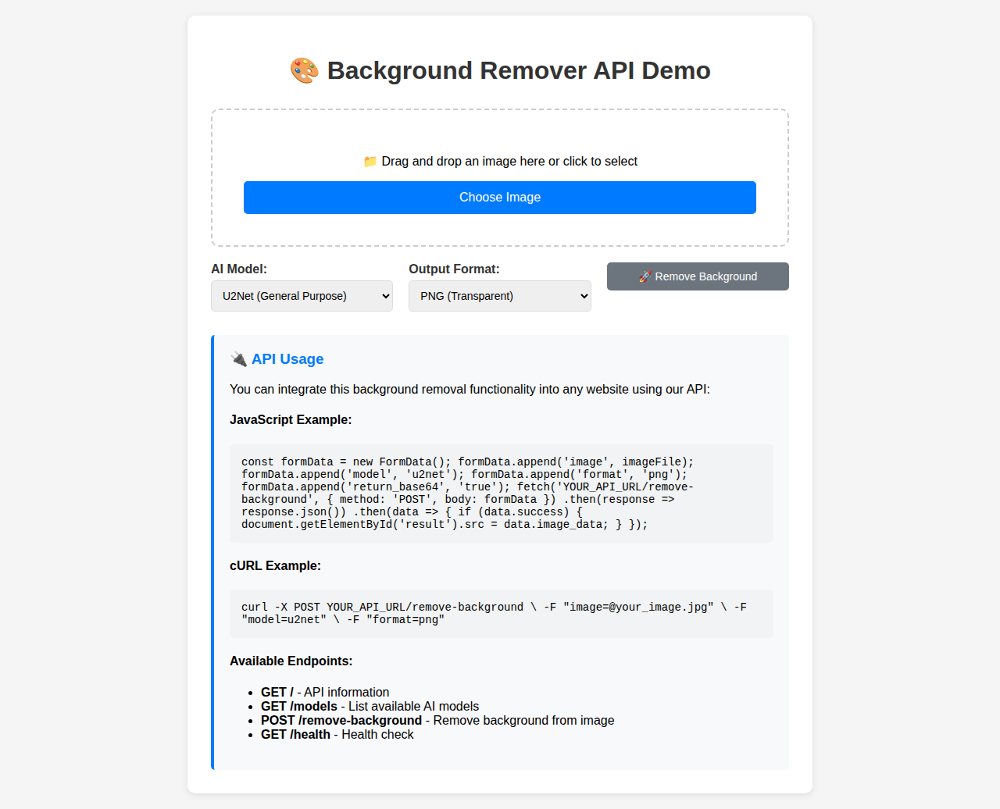
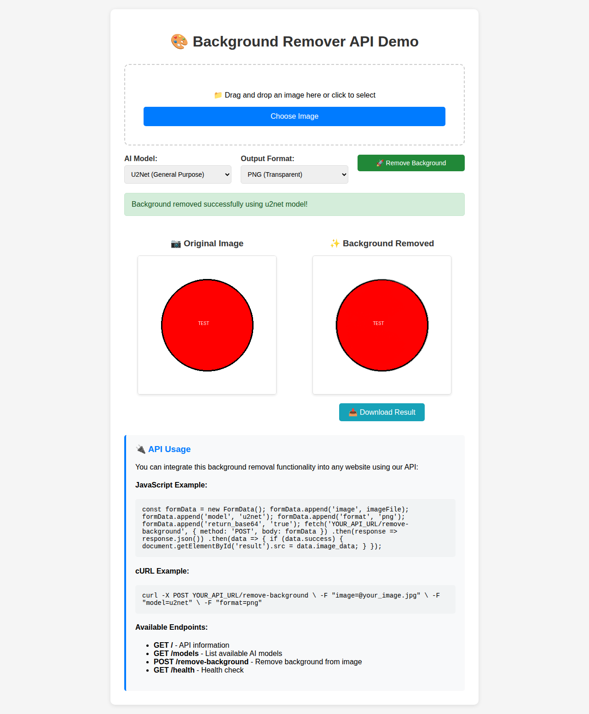

# 🎨 Advanced Background Remover API

A powerful, AI-powered REST API for removing backgrounds from images using state-of-the-art machine learning models. This API can be easily integrated into any website or application and supports multiple AI models for different use cases.

## ✨ Features

- **Advanced AI Models**: Multiple state-of-the-art background removal models
  - U2Net: General purpose background removal
  - U2Net+: Lightweight version for faster processing
  - Human Segmentation: Optimized for people and portraits
  - Clothing Segmentation: Perfect for fashion and e-commerce
  - ISNet: High accuracy general use model

- **Multiple Format Support**: 
  - Input: PNG, JPG, JPEG, WebP, BMP, TIFF
  - Output: PNG (transparent), JPG (white background), WebP

- **Cross-Origin Ready**: Full CORS support for integration with any website

- **Flexible Response Options**:
  - Direct file download
  - Base64 encoded response for web applications

- **Production Ready**: 
  - Comprehensive error handling
  - Input validation
  - File size limits
  - Health monitoring endpoints

## 🚀 Quick Start

### Installation

1. Clone the repository:
```bash
git clone https://github.com/Haggai-dev665/background-remover-API.git
cd background-remover-API
```

2. Install dependencies:
```bash
pip install -r requirements.txt
```

3. Start the server:
```bash
python app.py
```

The API will be available at `http://localhost:5000`

### Docker Deployment

```bash
# Build the image
docker build -t background-remover-api .

# Run the container
docker run -p 5000:5000 background-remover-api
```

## 📖 API Documentation

### Base URL
```
http://localhost:5000
```

### Endpoints

#### GET `/`
Get API information and available endpoints.

**Response:**
```json
{
  "message": "Advanced Background Remover API",
  "version": "1.0.0",
  "endpoints": {
    "/": "API information",
    "/remove-background": "POST - Remove background from image",
    "/models": "GET - List available models",
    "/health": "GET - Health check",
    "/demo": "GET - Demo page"
  },
  "supported_formats": [".png", ".jpg", ".jpeg", ".webp", ".bmp", ".tiff"],
  "max_file_size_mb": 10.0
}
```

#### GET `/health`
Health check endpoint.

**Response:**
```json
{
  "status": "healthy",
  "message": "Background Remover API is running"
}
```

#### GET `/models`
Get list of available AI models.

**Response:**
```json
{
  "models": ["u2net", "u2netp", "u2net_human_seg", "u2net_cloth_seg", "isnet-general-use"],
  "default": "u2net",
  "descriptions": {
    "u2net": "General purpose background removal",
    "u2netp": "Lightweight version of u2net",
    "u2net_human_seg": "Optimized for human subjects",
    "u2net_cloth_seg": "Optimized for clothing items",
    "isnet-general-use": "High accuracy general use model"
  }
}
```

#### POST `/remove-background`
Remove background from an uploaded image.

**Parameters:**
- `image` (file): Image file to process
- `model` (string, optional): AI model to use (default: "u2net")
- `format` (string, optional): Output format - "png", "jpg", "webp" (default: "png")
- `return_base64` (boolean, optional): Return base64 encoded result (default: false)

**Response (file download):**
Returns the processed image file directly.

**Response (base64):**
```json
{
  "success": true,
  "image_data": "data:image/png;base64,iVBORw0KGgoAAAANSUhEUgAA...",
  "format": "png",
  "model_used": "u2net",
  "original_size": [800, 600],
  "output_size": [800, 600]
}
```

#### GET `/demo`
Access the interactive demo page for testing the API.

## 💻 Usage Examples

### JavaScript (Web Browser)

```javascript
const formData = new FormData();
formData.append('image', imageFile);
formData.append('model', 'u2net');
formData.append('format', 'png');
formData.append('return_base64', 'true');

fetch('http://localhost:5000/remove-background', {
    method: 'POST',
    body: formData
})
.then(response => response.json())
.then(data => {
    if (data.success) {
        document.getElementById('result').src = data.image_data;
    }
})
.catch(error => console.error('Error:', error));
```

### cURL

```bash
# Download processed image
curl -X POST http://localhost:5000/remove-background \
  -F "image=@your_image.jpg" \
  -F "model=u2net" \
  -F "format=png" \
  -o result.png

# Get base64 response
curl -X POST http://localhost:5000/remove-background \
  -F "image=@your_image.jpg" \
  -F "model=u2net_human_seg" \
  -F "return_base64=true"
```

### Python

```python
import requests

url = "http://localhost:5000/remove-background"

with open("image.jpg", "rb") as f:
    files = {"image": f}
    data = {
        "model": "u2net",
        "format": "png",
        "return_base64": "true"
    }
    
    response = requests.post(url, files=files, data=data)
    
    if response.status_code == 200:
        result = response.json()
        if result["success"]:
            # Use result["image_data"] - contains base64 encoded image
            print(f"Success! Model used: {result['model_used']}")
```

### Node.js

```javascript
const FormData = require('form-data');
const fs = require('fs');
const axios = require('axios');

const form = new FormData();
form.append('image', fs.createReadStream('image.jpg'));
form.append('model', 'u2net_human_seg');
form.append('format', 'png');
form.append('return_base64', 'true');

axios.post('http://localhost:5000/remove-background', form, {
    headers: form.getHeaders(),
})
.then(response => {
    if (response.data.success) {
        console.log('Background removed successfully!');
        // Save or use response.data.image_data
    }
})
.catch(error => {
    console.error('Error:', error.response.data);
});
```

## 🖼️ Demo Screenshots

### Initial Demo Page


### Background Removal Result


The demo shows the API successfully removing the background from a test image, with the original red circle on the left and the background-removed version with transparency on the right.

## 🔧 Configuration

### Environment Variables

Create a `.env` file (copy from `.env.example`):

```bash
# Server configuration
PORT=5000
DEBUG=False

# File upload limits (in bytes)
MAX_FILE_SIZE=10485760  # 10MB

# Logging
LOG_LEVEL=INFO
```

### Supported AI Models

| Model | Use Case | Speed | Accuracy |
|-------|----------|-------|----------|
| u2net | General purpose | Medium | High |
| u2netp | Lightweight/mobile | Fast | Medium |
| u2net_human_seg | People/portraits | Medium | Very High |
| u2net_cloth_seg | Fashion/clothing | Medium | High |
| isnet-general-use | High accuracy | Slow | Very High |

## 🚀 Deployment

### Production Deployment with Gunicorn

```bash
# Install gunicorn (already in requirements.txt)
pip install gunicorn

# Start production server
gunicorn --bind 0.0.0.0:5000 --workers 4 app:app
```

### Heroku Deployment

The included `Procfile` makes Heroku deployment simple:

```bash
# Login to Heroku
heroku login

# Create app
heroku create your-app-name

# Deploy
git push heroku main
```

### Docker Production

```dockerfile
FROM python:3.9-slim

WORKDIR /app
COPY requirements.txt .
RUN pip install -r requirements.txt

COPY . .

EXPOSE 5000
CMD ["gunicorn", "--bind", "0.0.0.0:5000", "--workers", "4", "app:app"]
```

## 🧪 Testing

Run the included test script:

```bash
python test_api.py
```

This will test all endpoints and verify the background removal functionality.

## 📝 Limitations

- Maximum file size: 10MB (configurable)
- Maximum image dimensions: 4000x4000 pixels
- Minimum image dimensions: 10x10 pixels
- Supported input formats: PNG, JPG, JPEG, WebP, BMP, TIFF
- First request may be slower due to model loading

## 🤝 Contributing

1. Fork the repository
2. Create a feature branch
3. Make your changes
4. Add tests if applicable
5. Submit a pull request

## 📄 License

This project is licensed under the MIT License - see the [LICENSE](LICENSE) file for details.

## 🙏 Acknowledgments

- [rembg](https://github.com/danielgatis/rembg) - The underlying background removal library
- [U-2-Net](https://github.com/xuebinqin/U-2-Net) - The U-2-Net model architecture
- [Flask](https://flask.palletsprojects.com/) - The web framework

## 📞 Support

For support, please open an issue on GitHub or contact [support@yourapi.com](mailto:support@yourapi.com).

---

Made with ❤️ for developers who need powerful background removal capabilities.